# ReCAPgemini	
## Sujet	
Capgemini\
[Lien du site du projet](https://nathanboschi25.github.io/recapgemini/)
## Membres du groupe :	
 - [BOSCHI Nathan (référent)](mailto:nathan.boschi@edu.univ-fcomte.fr?subject=SAE_1_05_06)	
 - [MOUGAMMADALY Jessy](mailto:jessy.mougammadaly@edu.univ-fcomte.fr?subject=SAE_1_05_06)	
 - [GASNER Théo](mailto:theo.gasner@edu.univ-fcomte.fr?subject=SAE_1_05_06)	

## Présentation	
Ce dépôt correspond à un site web créé en HTML/CSS/JS dans le cadre de la SAÉ 05-06 à l'IUT de Belfort-Montbéliard. Ce site présente des informations concernant l'entreprise Capgemini et sert de vitrine pour présenter l'entreprise, ses activité, son organisation et son historique. Vous trouverez dans ce dépôt et sur le site un rapport économique analysant l'aspect économique de Capgemini.	

## Choix de conception	
Pour la conception du site, nous nous sommes grandement inspirés du site officiel de Capgemini (trouvable [ici](https://www.capgemini.com/fr-fr/)), du site d'un de ses principaux concurrents [Sopra Steria](https://www.soprasteria.fr/) et nous avons pris comme référence la charte de Capgemini disponible [ici](doc/charte_graphique.pdf).	

### Zoning	

**Ecran de zoning de la page d'accueil (état initial) :**
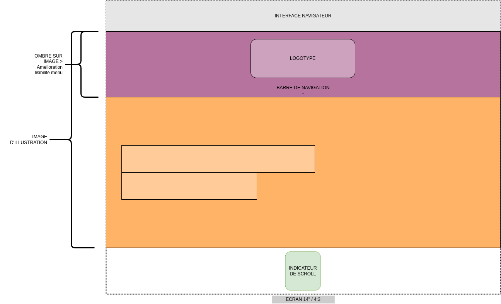
***/// Rendu final***
 
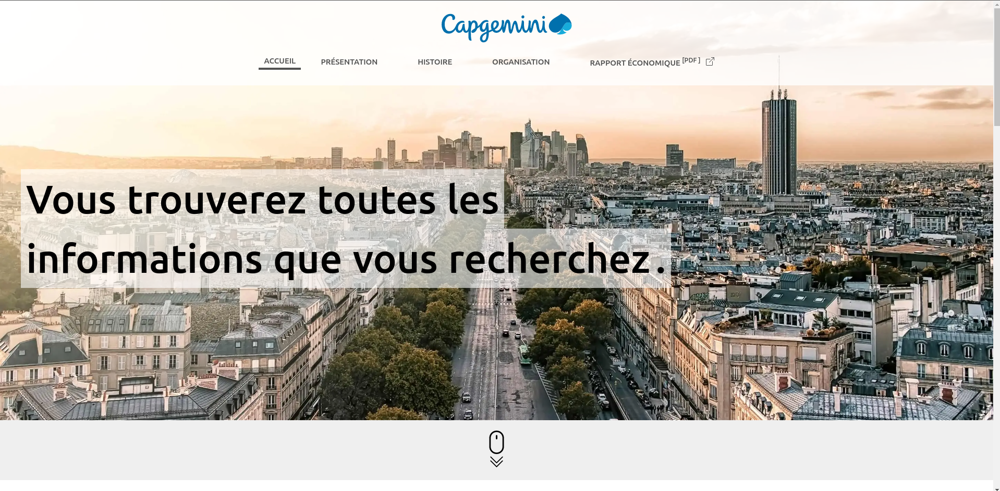

**Ecran de zoning de la page d'accueil (état post-défilement) :**
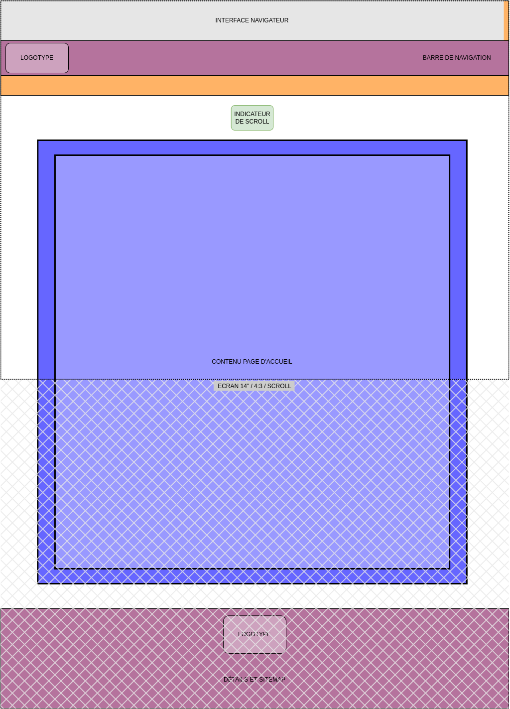
***/// Rendu final***
 
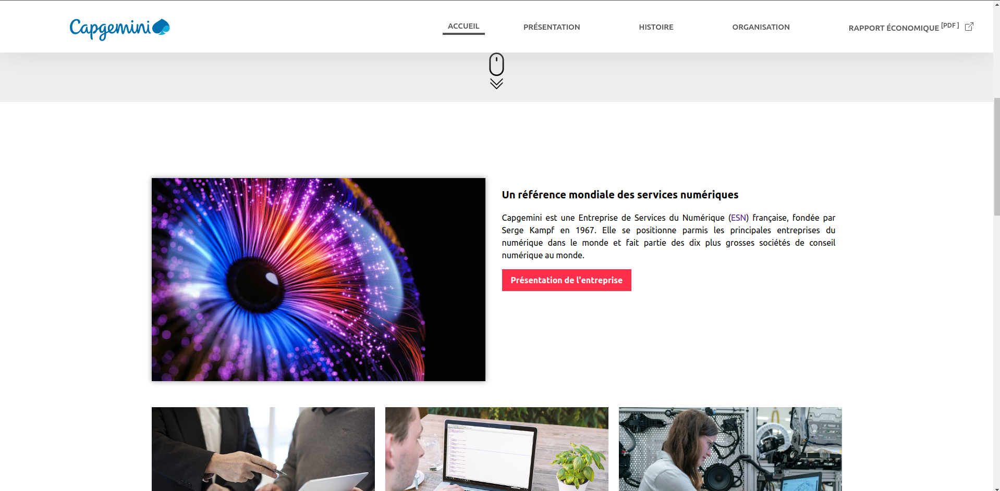

**Ecran de zoning du template :**
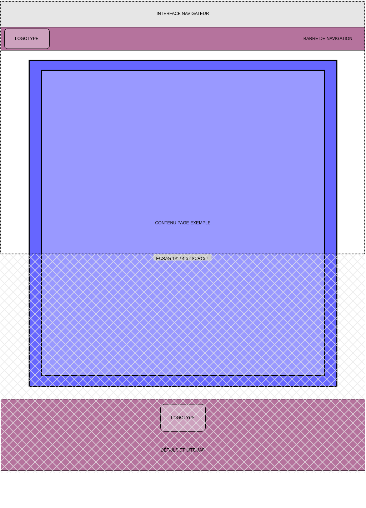	

**Ecran de wireframe du template pour les autres pages :**
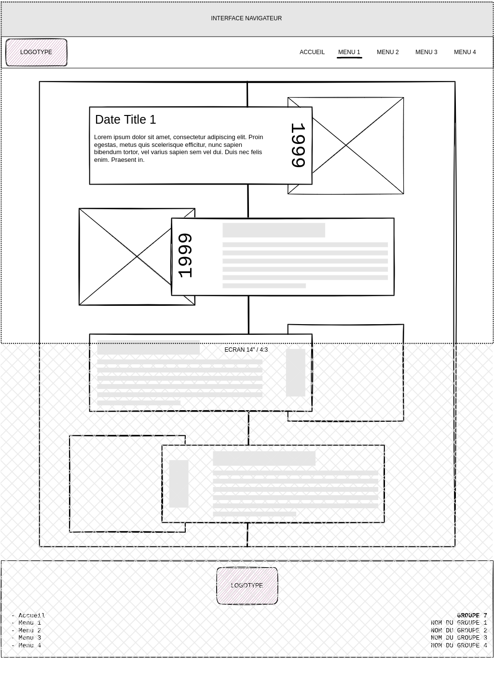	

### Menu

**Page d'accueil :**

**Menu général :**
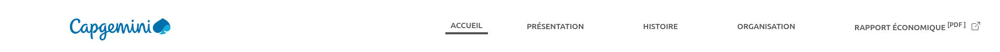

## Développement Site Web (Vérification W3C : [PDF](doc/validation.pdf))
### Page d'accueil
**Auteur : Nathan BOSCHI**\
Verification W3C : [Détail ICI](https://validator.w3.org/nu/?showsource=yes&showoutline=yes&showimagereport=yes&doc=https%3A%2F%2Fnathanboschi25.github.io%2Frecapgemini%2F)
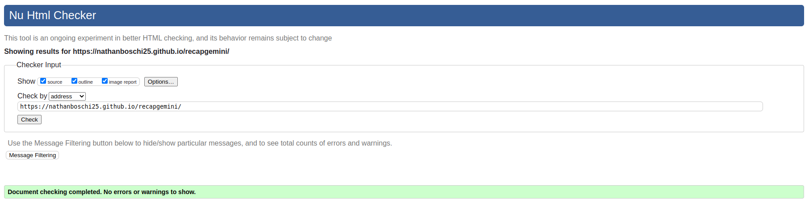

### Présentation générale
**Auteur : Nathan BOSCHI**\
Verification W3C : [Détail ICI](https://validator.w3.org/nu/?showsource=yes&showoutline=yes&showimagereport=yes&doc=https%3A%2F%2Fnathanboschi25.github.io%2Frecapgemini%2Fpresentation.html)
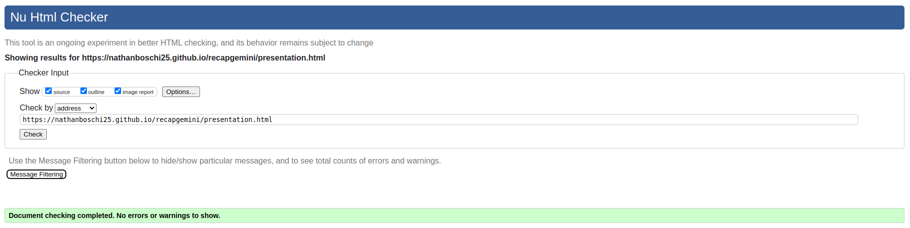

### Histoire
**Auteur : Jessy MOUGAMMADALY**\
Verification W3C : [Détail ICI](https://validator.w3.org/nu/?showsource=yes&showoutline=yes&showimagereport=yes&doc=https%3A%2F%2Fnathanboschi25.github.io%2Frecapgemini%2Fhistoire.html)
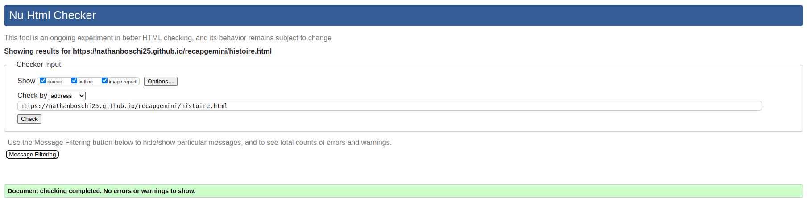

### Organisation
**Auteur : Théo GASNER**\
Verification W3C : [Détail ICI](https://validator.w3.org/nu/?showsource=yes&showoutline=yes&showimagereport=yes&doc=https%3A%2F%2Fnathanboschi25.github.io%2Frecapgemini%2Forganisation.html)
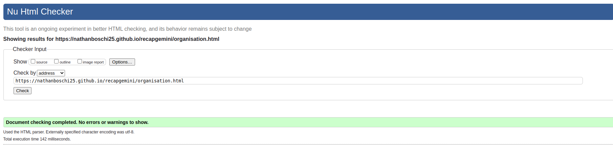

## Répartition du travail

### Planification - Diagramme de GANTT

- Nathan BOSCHI (100%)

### Recherches d'informations

- Théo GASNER (60%)
- Jessy MOUGAMMADALY (30%)

- Nathan BOSCHI (10%)

### Rapport économique

- Jessy MOUGAMMADALY (70%)
- Théo GASNER (20%)
- Nathan BOSCHI (10%)

### Developpement site

- Nathan BOSCHI (60%)
  - Page d'acceuil
  - Template de page (Navbar/Footer)
  - Page présentation
- Jessy MOUGAMMADALY (20%)
  - Page histoire
- Théo GASNER (20%)
  - Page organisation
